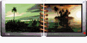



## Images\-in\-a\-Book

### Description

Create Album of Images and show as a book. Requires Windows XP
 
### More Info
 
-Take care with Corrupt files, It causes crash.

-Associate the extension (.ALB) to run with the Images-in-a-book.exe, the program will recognize and show the album.

             |
---                |---
**Submitted On**   |2006-06-12 22:20:30
**By**             |[Agustin Rodriguez](https://github.com/Planet-Source-Code/PSCIndex/blob/master/ByAuthor/agustin-rodriguez.md)
**Level**          |Intermediate
**User Rating**    |5.0 (50 globes from 10 users)
**Compatibility**  |VB 6\.0
**Category**       |[Data Structures](https://github.com/Planet-Source-Code/PSCIndex/blob/master/ByCategory/data-structures__1-33.md)
**World**          |[Visual Basic](https://github.com/Planet-Source-Code/PSCIndex/blob/master/ByWorld/visual-basic.md)
**Archive File**   |[Images\-in\-2000686132006\.zip](https://github.com/Planet-Source-Code/agustin-rodriguez-images-in-a-book__1-65657/archive/master.zip)

